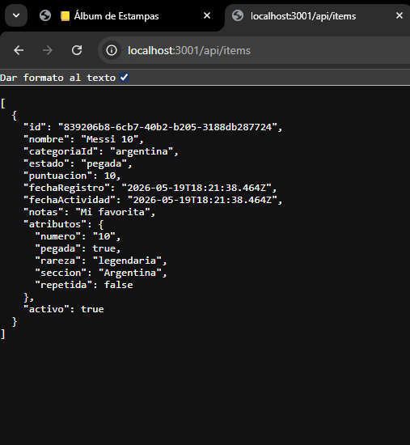
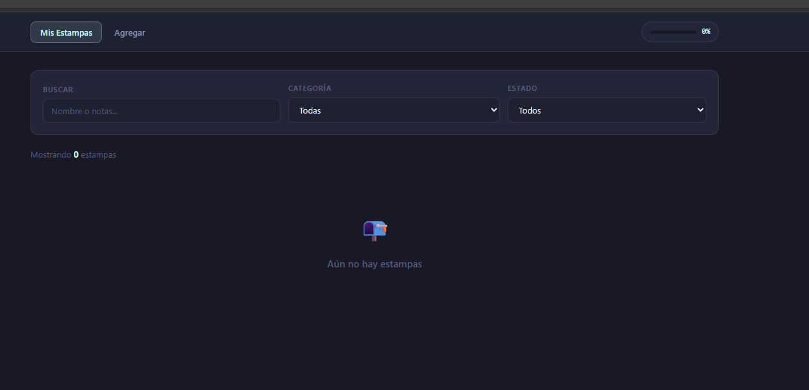

# Diego Sandoval 231977
# Tema elegido: Álbum de Estampas
 
> Tracker personal de colección de estampas — Mundial, Pokémon y NBA.  
> Registra cada estampa con sección, estado y rareza. Lleva el control de lo que tienes, lo que falta y lo que puedes intercambiar.
 
---

## para correr el front 

```bash
cd frontend
npm install
npm run dev
# → http://localhost:5173
```

## para correr el back

```bash
cd backend
cp .env.example .env
# Editar .env con tu la clave del pgadmin
npm install
npm run dev
# → http://localhost:3001

```
### imagen de la base corriendo y con datos x


