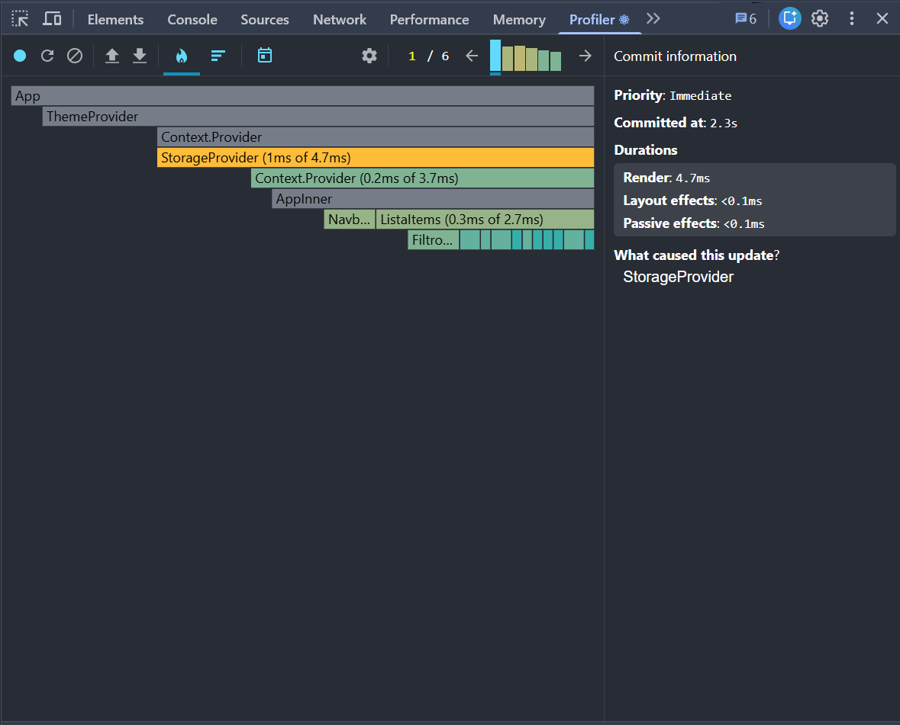
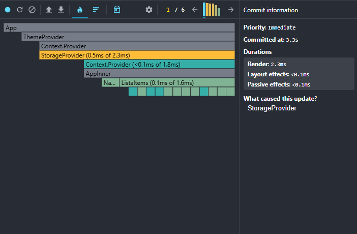

# Diego Sandoval 231977
# Tema elegido: Álbum de Estampas
 
> Tracker personal de colección de estampas — Mundial, Pokémon y NBA.  
> Registra cada estampa con sección, estado y rareza. Lleva el control de lo que tienes, lo que falta y lo que puedes intercambiar.
 
---

## para correr el front 

```bash
cd frontend
npm install
npm run dev
# → http://localhost:5173
```

## para correr el back

```bash
cd backend
cp .env.example .env
# Editar .env con tu la clave del pgadmin
npm install
npm run dev
# → http://localhost:3001

```
### Nuevas funcionalidades

- **Switch de modo (API / Local):** Botón en la Navbar que cambia entre `localStorage` y la API. Al cambiar de modo se cargan los datos de cada uno.
- **Tema claro/oscuro:** Botón ☀️/🌙 en la Navbar este tema se mantiene al refrescar y cuenta con el atajo de teclado `T` 
- **Atajos de teclado:**
  - `Ctrl+N`  nos manda a agregar una nueva estampa y directos al nombre
  - `T`  cambia entre los temas de calro y oscuro 

---

## Mi paleta de colores
 
### Tema Oscuro
 
| Variable | Valor | Decisión |
|----------|-------|----------|
| `--color-bg` | `#181925` | Fondo base azul para evitar el aburrido negro. |
| `--color-bg-surface` | `#232638` | Superficie de tarjetas de un tono mas claro para dar contraste |
| `--color-accent` | `#C0F5FA` | Celeste claro para dar un tipo de importancia a este color|
| `--color-success` | `#4ade80` | Verde para validar las pegadas. |
| `--color-danger` | `#f87171` | Rojo para alertas o borrar y para referir que aun no se tiene una estampa. |
| `--color-text-muted` | `#8b90b0` | Texto secundario con un buen contraste pero dejando en claro que es secundario. |
 
### Tema Claro
 
| Variable | Valor | Decisión |
|----------|-------|----------|
| `--color-bg` | `#f4f6fb` | celeste muy claro para no usar el tipico blanco. |
| `--color-bg-surface` | `#ffffff` |Blanco para dar el contraste de las tarjetas . |
| `--color-accent` | `#1a73c8` | Azul fuerte mismo que el celeste de tema oscuro |
| `--color-success` | `#16a34a` | Verde para validar las pegadas.. |
| `--color-danger` | `#dc2626` | ojo para alertas o borrar y para referir que aun no se tiene una estampa. |
| `--color-text-muted` | `#4a4f6a` |Texto secundario con un buen contraste pero dejando en claro que es secundario.. |
 
---

### imagen de los dos temas de colores y de los dos modos (api y local )


## Fase 3
### usereducer
El reducer que se usa esta dentro del archivo, itemsReducer.js. Esta funcion no hace fetch ni llama newdata. Las fechas se calculan en storagecontext.

Esta tiene acciones como:
`HIDRATAR`, `AGREGAR`, `ELIMINAR`, `CAMBIAR_ESTADO`, `FILTRAR`, `LIMPIAR_FILTROS`, `REGISTRAR_ACTIVIDAD`, `EDITAR`, `RESTAURAR`, `BORRAR`.

### Graficas
Estan dentro del archivo Graficas en el folder componentes, estos cuentan con sus propia barra de filtros. Los tres graficos trabajan leyendo los filtros .

1. **Progreso de pegadas en el tiempo** (`LineChart`): sube cuando pego una estampa y baja cuando la despego, agrupado por día.
2. **Distribución por categoría** (`PieChart`): cuántas estampas hay de cada selección.
3. **Distribución por rareza** (`BarChart`): cuántas estampas tengo de cada rareza.


### Optimización

Imagen antes de React.memo y react.memo


Imagen despues de React.memo y react.memo

Análisis: Al escribir en el buscador, antes todas las ItemCard se renderizaban en cada tecla. Después de aplicar React.memo, useMemo y useCallback, solo se actualizan el buscador y la lista filtrada. Las tarjetas cuyos datos no cambian ya no se renderizan, lo que se observa en el Profiler porque aparecen como "Did not render".

### mis tres decisiones tecnicas 

1. **Filtros dentro del reducer:** los metí en el mismo estado que la lista para tener una sola fuente de verdad.
2. **Reducer puro:** la fecha la calcula `StorageContext` y la pasa en el `payload`, así el reducer nunca llama a `new Date()`.
3. **Gráfica de progreso:** `cambiarEstado` registra un evento `+1` o `-1` con la fecha cada vez que una estampa entra o sale de "pegada". La gráfica reconstruye la línea hacia atrás partiendo del total real de hoy.